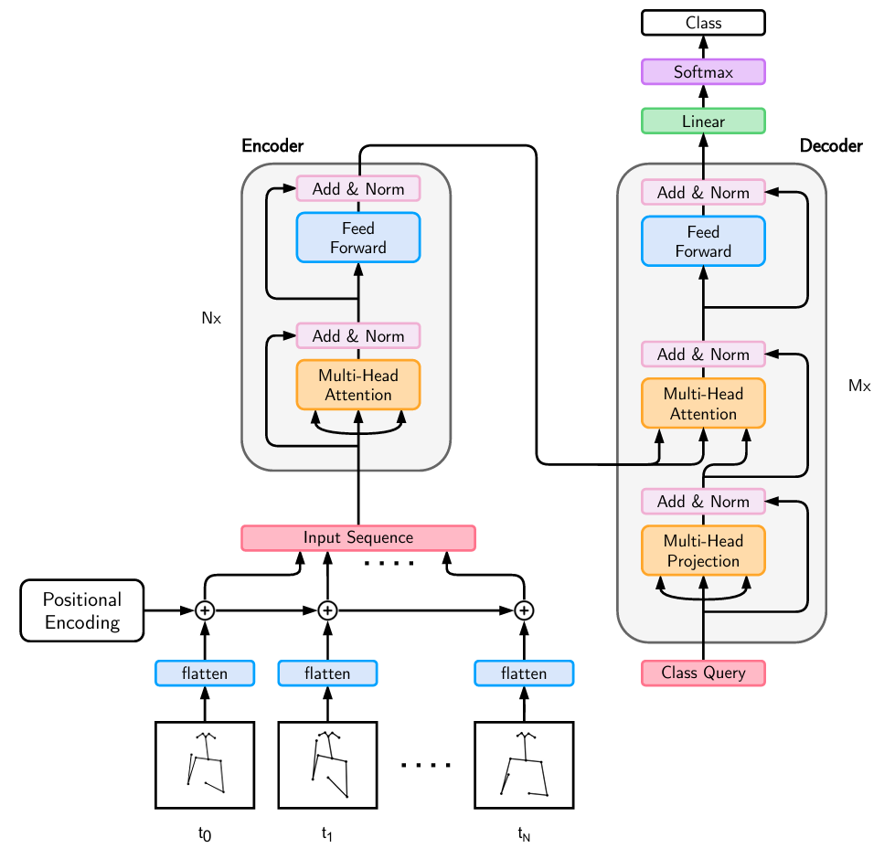

# SPOTER-208 기반 한국 수어 300단어 분류

MediaPipe로 추출한 2D 랜드마크 시퀀스만으로 **고립 수어 단어(isolated sign) 하나를 300개 클래스 중 하나로 분류**하는 파일럿 프로젝트다. RGB 영상 대신 자세 좌표를 Transformer에 입력하는 SPOTER의 핵심 아이디어를 따르되, 이 데이터셋의 208차원 특징에 맞게 모델 폭과 입력 계층을 수정했다.

> 이 모델은 영상 안에서 단어의 시작과 끝을 찾거나 문장을 번역하지 않는다. 이미 한 단어 단위로 잘린 시퀀스를 입력받아 클래스 하나를 예측한다.

## 모델 개요

입력은 한 영상에서 얻은 프레임별 특징 행렬 `X ∈ R^(T×208)`이며, 출력은 300개 단어에 대한 logits `z ∈ R^300`이다. 시퀀스 전체의 시간적 관계는 Transformer Encoder가 학습하고, 학습 가능한 **Class Query 하나**가 Decoder의 cross-attention을 통해 전체 encoder memory를 요약한다. 마지막 선형 분류기가 이 표현을 단어 클래스로 변환한다.

<p align="center">
  
</p>

<p align="center"><em>SPOTER의 개념적 구조. 프레임별 자세 특징과 위치 정보를 Encoder에 전달하고, 하나의 Class Query가 Decoder에서 전체 시퀀스를 읽어 최종 클래스를 예측한다.</em></p>

이 프로젝트에서 실제 텐서가 흐르는 순서는 다음과 같다.

```text
landmark sequence                 [B, T, 208]
    │
    ├─ Linear projection          208 → 256
    ├─ LayerNorm
    ├─ learned positional embedding
    ▼
Transformer Encoder × 6          [B, T, 256]
    │                              └─ padding frame은 attention에서 제외
    │
    └──────── encoder memory ─────────────┐
                                          ▼
learned Class Query [B, 1, 256] → Transformer Decoder × 6
                                          │
                                          ▼
                               decoded query [B, 256]
                                          │
                                  LayerNorm + Linear
                                          ▼
                                    logits [B, 300]
```

Decoder는 문장을 생성하는 autoregressive decoder가 아니다. Query가 하나뿐이고 causal mask도 사용하지 않으며, encoder가 만든 전체 시퀀스 표현을 cross-attention으로 모아 **영상 하나를 대표하는 분류 벡터 하나**를 만든다. 모델은 학습 시 raw logits를 반환하고 `CrossEntropyLoss`가 softmax를 내부적으로 처리한다.

### 모델 설정

| 항목 | 설정 |
|---|---:|
| 입력 특징 | 프레임당 208차원 (`spoter2_mp_xy_v1`) |
| 최대 시퀀스 길이 | 256 frames |
| hidden dimension | 256 |
| attention heads | 8 |
| Encoder / Decoder | 6 / 6 layers |
| feed-forward dimension | 1,024 |
| activation / dropout | GELU / 0.1 |
| positional encoding | 학습형(learned) |
| 출력 | 300-class logits |

구현은 [`src/model.py`](src/model.py), 전체 하이퍼파라미터는 [`configs/pilot300_base.yaml`](configs/pilot300_base.yaml)에서 확인할 수 있다.

## 논문과의 관계

기반 논문인 *Sign Pose-Based Transformer for Word-Level Sign Language Recognition*은 RGB appearance 대신 정규화한 2D body/hand pose를 이용해 계산량을 줄이고, Encoder와 단일 Class Query Decoder로 단어 수준 수어를 분류한다. 또한 signing space를 고려한 신체 좌표 정규화, 손의 독립적인 지역 좌표계, pose augmentation이 정확도에 중요하다고 보고한다.

이 저장소는 논문의 완전한 재현이 아니라 **한국 수어 데이터와 기존 MediaPipe 전처리 특징에 맞춘 변형 모델**이다.

| 구분 | 원 논문 SPOTER | 이 프로젝트 SPOTER-208 |
|---|---|---|
| 공통 핵심 | Transformer Encoder + 단일 Class Query Decoder | 동일 |
| 입력 | 정규화된 108차원 pose | 전처리된 208차원 MediaPipe 특징 |
| 입력 투영 | pose 차원을 model dimension으로 직접 사용 | `Linear(208 → 256)` 추가 |
| attention heads | 9 | 8 (`256`을 균등 분할) |
| 위치 정보 | positional encoding | 최대 256 길이의 learned embedding |
| 분류 대상 | WLASL, LSA64 | 한국 수어 300단어 |

논문은 저장소의 [로컬 PDF](<Bohacek_Sign_Pose-Based_Transformer_for_Word-Level_Sign_Language_Recognition_WACVW_2022_paper.pdf>) 또는 [CVF Open Access](https://openaccess.thecvf.com/content/WACV2022W/HADCV/html/Bohacek_Sign_Pose-Based_Transformer_for_Word-Level_Sign_Language_Recognition_WACVW_2022_paper.html)에서 볼 수 있다.

## 데이터와 분할

- 클래스: `일상_고빈도_핵심단어_300.csv`에서 선정한 300단어
- 분할: 촬영자 기준 Train `REAL01~06`, Validation `REAL07~08`, Test `REAL09`
- 샘플: Train 8,994 / Validation 3,000 / Test 1,500, 총 13,494개
- 시퀀스 길이: 60~250 frames, 중앙값 120, p95 162, p99 187.07
- 무결성 검사: feature 차원·버전, NaN/Inf, frame index, part mask를 검사했으며 오류 0개

동일한 `(word_id, actor_id)` 그룹은 서로 다른 split에 섞이지 않는다. 고정 분할은 `data/splits.json`, 원본에서 찾지 못한 Train 샘플 6개는 `data/missing_samples.json`에 기록되어 있다. 모든 split에 300개 클래스가 빠짐없이 포함된다. 원본 HDF5는 읽기 전용으로 참조하며 복사·수정·삭제하지 않는다.

## 학습

seed 42, batch size 32, AdamW(`lr=1e-4`, `weight_decay=0.01`), 5-epoch warm-up과 cosine schedule, FP16, gradient clipping 1.0을 사용했다. 최대 100 epochs 동안 validation macro Top-1을 기준으로 checkpoint를 선택하고, 15 epochs 동안 개선이 없으면 종료한다.

학습에 앞서 synthetic shape/padding invariance test, 32-sample overfit(100%), 10-class smoke run(validation macro Top-1 88%)으로 데이터와 모델 경로를 점검했다. 본 학습은 86 epoch에서 early stopping되었고 최고 validation macro Top-1은 91.77%였다.

```powershell
$py = 'C:\Users\PJ15\AppData\Local\Programs\Python\Python312\python.exe'
& $py -m pip install -r requirements.txt
& $py scripts/build_data.py --config configs/pilot300_base.yaml
& $py scripts/validate_data.py --config configs/pilot300_base.yaml
& $py scripts/train.py --config configs/pilot300_base.yaml --mode overfit32
& $py scripts/train.py --config configs/pilot300_base.yaml --mode smoke10
& $py scripts/train.py --config configs/pilot300_base.yaml --mode train
& $py scripts/calibrate.py --config configs/pilot300_base.yaml
& $py scripts/evaluate.py --config configs/pilot300_base.yaml
& $py scripts/export.py --config configs/pilot300_base.yaml
```

`train.py`는 run 디렉터리에 `last.pt`가 있으면 중단 지점부터 이어서 학습한다. epoch별 기록은 `history.csv`에 저장된다.

## 평가 결과

모델 선택에 사용하지 않은 촬영자 `REAL09`의 1,500개 샘플을 한 번 평가한 결과다.

| 지표 | REAL09 Test |
|---|---:|
| Macro Top-1 | **98.33%** |
| Micro Top-1 | **98.33%** |
| Top-3 | **99.87%** |
| Top-5 | **100.00%** |
| Macro F1 | **98.16%** |

카메라별 Top-1은 D 98.0%, F 98.0%, L 98.33%, R 99.0%, U 98.33%였다. 다만 한 명(`REAL09`)만을 대상으로 한 actor-independent holdout 결과이므로 일반화 성능을 확정하는 수치는 아니다. 향후 `REAL10~16`을 포함한 공식 validation/test split에서 다시 평가해야 한다.

Validation set으로 temperature scaling을 수행한 결과 최적 온도는 1.84893이었고 NLL은 0.7831에서 0.5285로 감소했다. TorchScript 변환 후 길이 64, 128, 187, 250에서 원본 PyTorch 모델과 최대 logit 차이가 모두 0이었으며 Top-1/Top-5도 일치했다.

주요 산출물은 `runs/pilot300_spoter_base_seed42_train/`에 저장된다.

- `best.pt`, `last.pt`: 모델 checkpoint
- `test_metrics.json`, `per_class_metrics.csv`, `top_confusions.csv`: 평가 결과
- `confusion_matrix.png`: confusion matrix
- `calibration.json`: temperature 및 confidence threshold별 coverage/accuracy
- `model_torchscript.pt`, `export_parity.json`: 배포 모델 및 변환 일치성 검사 결과

## 참고문헌

Matyáš Boháček and Marek Hrúz, “Sign Pose-Based Transformer for Word-Level Sign Language Recognition,” *WACV Workshops*, 2022, pp. 182–191.
